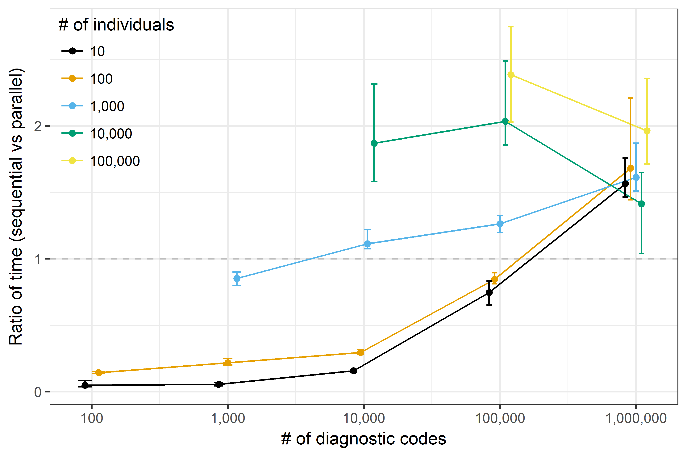

# Summary

Comorbidity scores are extensively used in observational medical research studies to avoid potential bias when the burden of disease could be confounding the association of interest. This is of primary importance, given the increasing availability and use of administrative data (such as medical records and insurance claims) for research purposes. Several comorbidity scores have been proposed throughout the years; however, two of them result being used most frequently in practice: the Charlson comorbidity index [@Charlson_1987] and the Elixhauser comorbidity index [@Elixhauser_1998]. The Charlson comorbidity index defines a set of comorbid conditions using International Classification of Disease (ICD) diagnostic codes. Each comorbid condition has an associated weight, and the sum of all weights results in a single comorbidity score per patient. The current version of the Charlson score includes 17 comorbidities. Similarly, the Elixhauser comorbidity index is based on ICD diagnostic codes and includes 31 comorbidities. In origin, the Elixhauser index score was based on the cumulative number of conditions present; since then, several weighting systems accounting for the increase or decrease in mortality risk associated with each condition have been proposed and used in practice [@vanWalraven_2009; @Moore_2017].

`comorbidity` is an R package that allows computing comorbidity scores in an easy and straightforward way. `comorbidity` is available from the Comprehensive R Archive Network (CRAN) and from GitHub at https://github.com/ellessenne/comorbidity. The main function of the package is named `comorbidity` as the package. It allows estimating any of the supported scores, which can be selected via the `score` argument. Currently, the Charlson comorbidity score and the Elixhauser comorbidity score are supported, using either the ICD-9-CM or the ICD-10 coding system. The implementation is based on the coding algorithms published by Quan _et al_. in 2005 [@Quan_2005]. The weighting system implemented for the Charlson score is based on the original paper by Charlson _et al_. [@Charlson_1987]; conversely, we implemented the weighting system proposed by Moore _et al_. for the Elixhauser score [@Moore_2017]. Given that the version of the Elixhauser score studied by Moore _et al_. only included 29 comorbid conditions, we applied weights from van Walraven _et al_. for the remaining domains [@vanWalraven_2009]. We also categorise each comorbidity score following work by Menendez _et al_. [@Menendez_2014].

Internally, each comorbidity score is coded separately and called by the `comorbidity` function. This provides two benefits: it makes it easy to maintain the package, and it makes it trivial to implement new scores in the future. Finally, computing comorbidity scores can be time-consuming with large datasets (both in terms of number of patients and diagnostic codes). Parallel computing is supported out of the box to mitigate this potential problem, with no additional programming required by the user: it is sufficient to set the argument `parallel = TRUE` when calling `comorbidity`. All processing cores available on a machine are used by default, but it is possible to manually set how many cores to use via the `mc.cores` argument. The advantage in terms of computational speed can be significant, especially with large dataset: the parallel implementation is approximately twice as fast for datasets with 100,000 individuals and 1,000,000 diagnostic codes (Figure 1, timed using a laptop with a dual-core i5-6300U processor and 8 GB of RAM).

__Figure 1:__ comparison of sequential vs parallel implementation of `comorbidity` on a laptop with a dual-core i5-6300U processor and 8 GB of RAM. Each data point represents the average ratio over a set of 10 replications; the vertical bars represent the minimum and the maximum ratio.

# References
